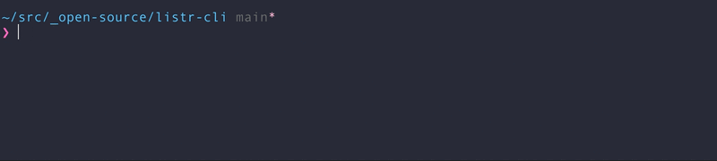

# listr-cli

Command-line task lists made pretty.

<p align="center"></p>

Gracefully handles and displays failures, including if a given command is not found.

## Install

```sh
npm install listr-cli
```

## Usage

```
$ listr

  Usage
    $ listr <command> [...]

    Commands should be space-separated. Commands with spaces in them must be surrounded by quotes.

    Equivalent to 'command1 && command2 && ...'.

  Options
    --all-optional  Continue executing tasks if one fails.      [default: exit]
    --hide-timer    Disable showing successful task durations.  [default: show]

  Examples
    Run test commands in order
    $ listr xo 'c8 ava'

    Run commands that can fail
    $ listr xo ava tsd --all-optional
```

## Related

- [listr2](https://github.com/cenk1cenk2/listr2) - The library used to build this.
